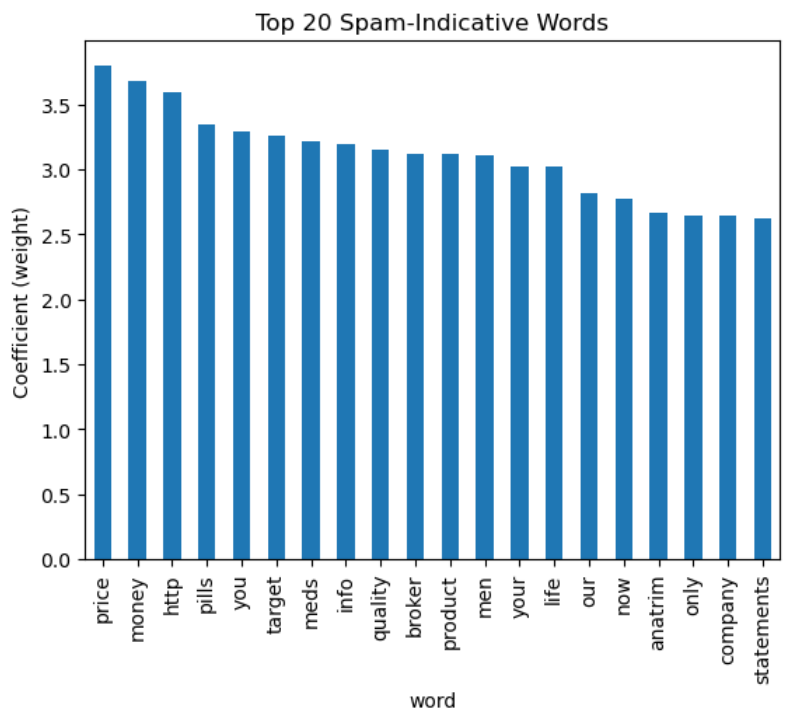

🚀 Email Spam Classifier: NLP & Logistic Regression
This project implements a text classification pipeline to identify spam using a refined version of the 2007 TREC and Enron datasets.

🛠️ Technical Highlights
Data Engineering: Optimized a 130MB raw text corpus down to 18MB (86% reduction) through Regex-based noise reduction and class rebalancing to mimic modern email distributions.

NLP Pipeline: Utilized TF-IDF Vectorization with a custom-filtered vocabulary (frequency > 100, length > 2) to capture high-signal predictors.

Class Imbalance Handling: Implemented weighted Logistic Regression (2:1 Ham/Spam penalty) to prioritize minimizing "False Positives"—ensuring legitimate emails are not accidentally discarded.

Feature Analysis: Extracted and visualized model coefficients to identify the top 20 keywords most indicative of spam.
